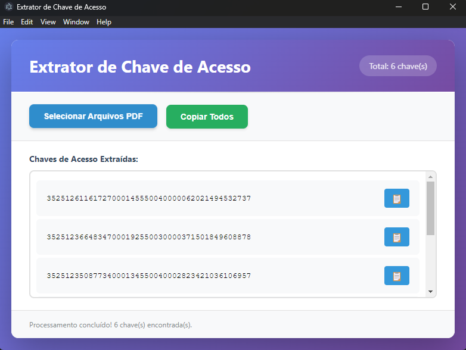

# Extrator de Chave de Acesso

Aplicação Electron para extrair Chaves de Acesso (48 dígitos) de arquivos PDF de Nota Fiscal Eletrônica.

## Preview



## Requisitos

- Node.js 14+ 
- npm

## Instalação

```bash
npm install
```

## Como usar

### Desenvolvimento

```bash
npm start
```

### Gerar Executável

Para gerar o executável Windows:

```bash
npm run build:win
```

O executável será gerado na pasta `dist/`.

## Funcionalidades

- Selecionar um ou múltiplos arquivos PDF de Nota Fiscal Eletrônica
- Extrair automaticamente a Chave de Acesso (48 dígitos) de cada arquivo
- Visualizar todas as chaves extraídas em uma lista
- Copiar chaves individuais através do botão de copiar ao lado de cada chave
- Copiar chave selecionada usando atalho Ctrl+C
- Copiar todas as chaves de uma vez (botão "Copiar Todos")
- Drag and Drop de arquivos PDF

## Tecnologias

- Node.js
- Electron
- pdf-parse
- electron-builder
